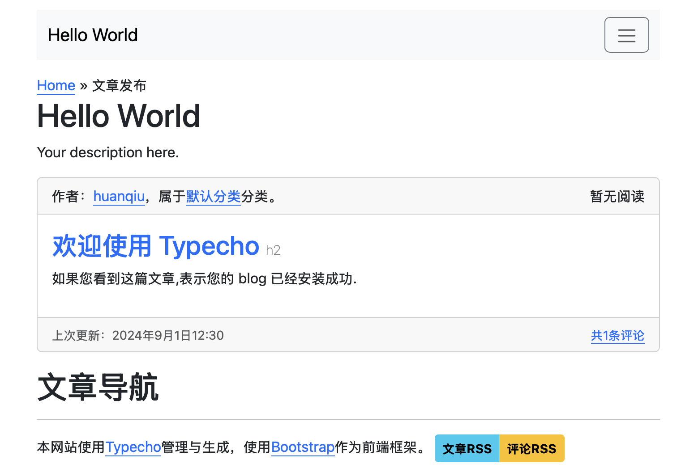
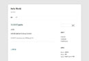

# Typecho主题Bootpecho v1.0

以Bootstrap 5提供的组件重新思考设计的Typecho主题。

大幅修改自Typecho主题Twenty Twelve（由怡红公子从WordPress版本移植）。

优点：

- 响应式设计。
- 原生支持深色模式。
- 原生支持阅读量统计，使用本地统计。作者：https://www.cnblogs.com/outsrkem/p/12182275.html 。

包内含cdnjs分发的Bootstrap文件，作者：https://getbootstrap.com ，在您的网站底部也会有相关引用。

样式效果请见我的博客：http://huanqiu.xiaocaozz.top 。

## 快速开始

1. 点击“Code”，“Download ZIP”下载压缩包。
2. 解压ZIP包，重命名为`Bootpecho`。
3. 将`Bootpecho`文件夹放入您的网站目录下的`usr/themes`目录，并在Typecho后台启用。

---

# 以下为原作者包内的README.md：

### Typecho主题Twenty Twelve v1.2

移植自Wordpress默认主题2012版，纯白双栏极简风格。

###### 更多详见作者博客：https://imnerd.org/twentytwelve-for-typecho.html
